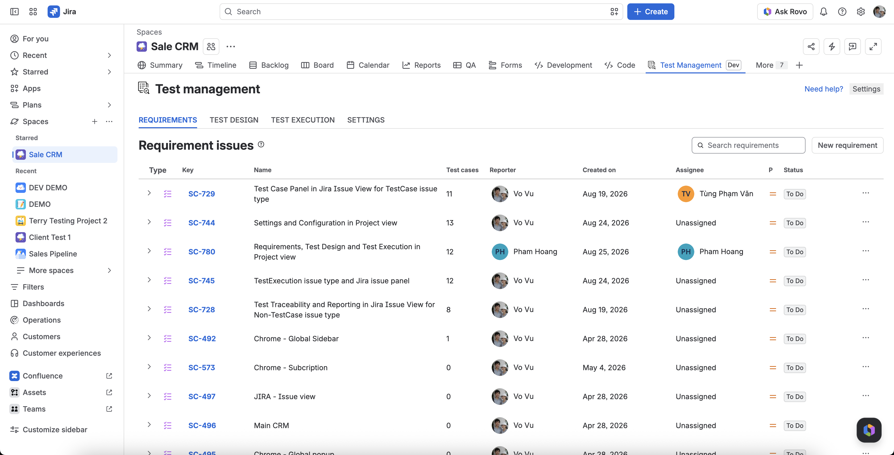
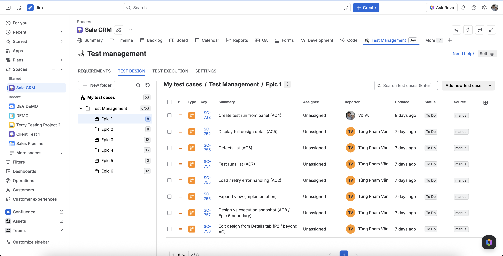
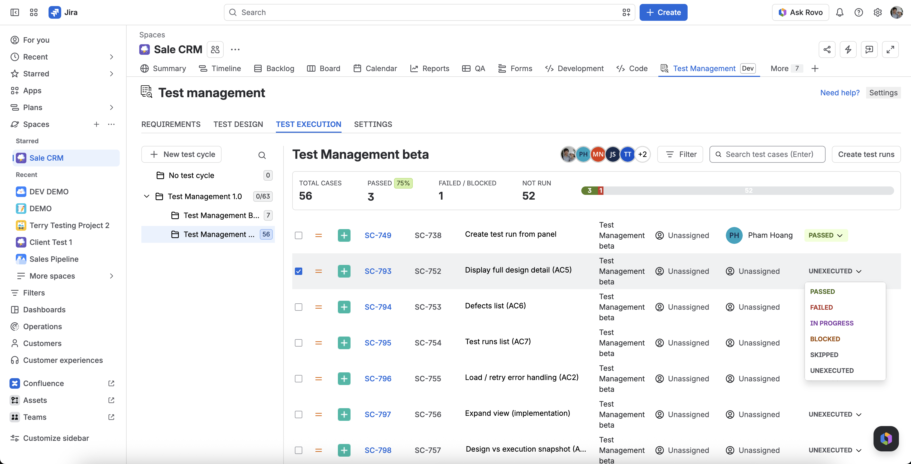
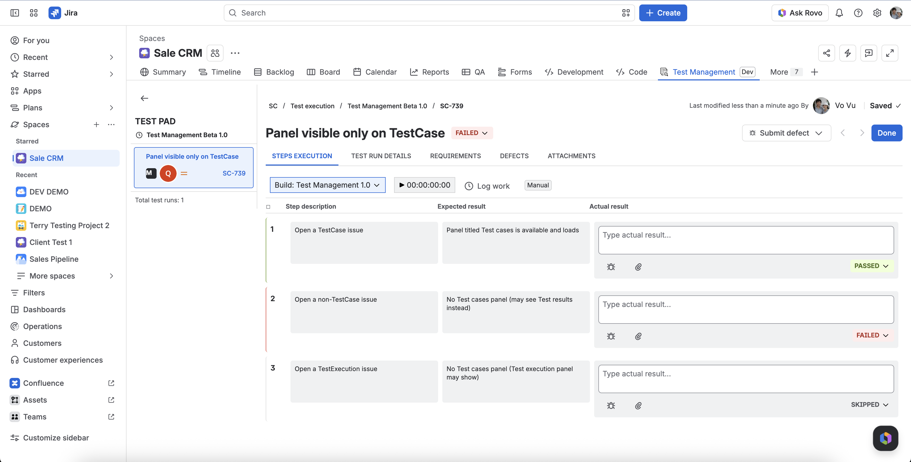

# QAnalyzer JavaScript SDK

Publish test results from JavaScript/TypeScript projects to **QA Engine for Jira** ([`qanalyzer-app`](../qanalyzer-app/)) — a Forge app that ingests Jest/Vitest JSON, stores launches, and syncs traceability to Jira.

> **Status:** Under active development. APIs and package versions may change between releases. Pin to a specific version (currently **2.0.0**) in production CI.

## What you get in Jira

QA Engine adds a **Test Management** hub to your Jira project. The SDK is the CI bridge: after your pipeline runs, uploads appear as **launches** and sync to TestCase / TestExecution issues, feeding the views below.

### Key highlights

- **Jira-native TMS** — Requirements, TestCases, TestExecutions, and Bugs as named issue types; no separate test tool to manage
- **End-to-end workflow** — Requirements → Test Design → Test Execution → Test Pad, all inside the project page
- **CI ingest** — this SDK POSTs Jest/Vitest JSON to a Forge web trigger; launches sync to Jira on a schedule
- **Traceability** — link test cycles to stories/epics and see pass/fail coverage on any non-TestCase issue
- **Design vs execution** — TestCase holds design steps; each run clones a snapshot onto a TestExecution issue (same launch re-sync reuses that TE)
- **Issue panels** — TestCase, TestExecution, and Test results panels on Jira issues without leaving the issue view

| Area | What it does |
| ---- | ------------ |
| **Requirements** | Track requirement issues, link TestCases, and see coverage counts per requirement |
| **Test Design** | Organize TestCases in suite folders; edit steps, preconditions, and expected results |
| **Test Execution** | Run test cycles, track pass/fail/blocked per case, and see cycle-level progress |
| **Test Pad** | Execute tests step-by-step; record actual results, defects, attachments, and time |
| **Issue panels** | TestCase design/runs on TestCase issues; run history on TestExecution; coverage on stories/epics |

### Requirements

Link TestCases to requirements and see how many cases cover each need.



### Test Design

Build and organize TestCases in a suite tree. Design detail (steps, expected results) lives on the TestCase — separate from execution snapshots.



### Test Execution

Manage test cycles, assign cases, set run status (Passed, Failed, Blocked, Skipped), and monitor cycle progress. **CI uploads from this SDK populate launches here** after ingest sync completes.



### Test Pad

Record manual or exploratory runs step-by-step on a TestExecution issue: expected vs actual, defects, attachments, and work logging. CI uploads create TestExecution issues with step snapshots cloned from the linked TestCase.



### Issue panels (Jira issue view)

Beyond the project hub, QA Engine adds context on individual issues:

- **TestCase panel** — design detail, linked defects, test runs, and quick navigation to Test Design
- **Test Execution panel** — linked TestCase, launch history, and run status on TestExecution issues
- **Test results panel** — link test cycles to stories/epics and see executed/passed/failed coverage

These panels complement CI ingest: automated runs land as launches and TestExecutions; panels surface that history on the issues your team already works in.

### From CI to Jira (SDK role)

```text
Your test runner  →  @qanalyzer/forge-* reporter or CLI  →  Forge web trigger
                                                              ↓
                                                    Launch stored in QA Engine
                                                              ↓
                              TestCase / TestExecution issues + Test Execution view updated
```

- **Automated CI:** set `QANALYZER_MODE=ingest` — reporters upload when the run finishes.
- **Optional metadata:** include Jira issue keys in test titles (`AUTH-101 login`) for traceability.
- **Rich steps:** use `qa.suite` / `qa.step` helpers (Jest/Vitest) so suite hierarchy appears in ingest payloads.
- **Large suites:** reports above ~3.5 MB chunk automatically; transient upload errors retry.

Configure ingest in Jira under **Test Management → Settings → Automation setup** ([Epic 4 in the PRD](../qanalyzer-app/docs/prd.md)).

## Who this is for

Use this SDK if you:

- Run tests with **Jest, Vitest, Mocha, Cypress, Playwright, WebdriverIO, or CucumberJS**
- Have **QA Engine** installed on your Jira Cloud site
- Want CI (or local runs) to **upload a launch** after tests finish

You do **not** need to run any extra server. Uploads go directly to the Forge **web trigger** URL from your project settings.

## Before you start

1. **Install QA Engine** on your Jira site and open a project.
2. Go to **Test Management → Settings → Automation setup**.
3. Connect the project and **generate an ingest token** (shown once — store it in CI secrets).
4. Copy the **ingest URL** (Forge web trigger) from the same screen.

You need three values for CI:

| Variable | Where to get it |
| -------- | --------------- |
| `QANALYZER_INGEST_URL` | Automation setup → ingest URL |
| `QANALYZER_INGEST_TOKEN` | Automation setup → token (Bearer) |
| `QANALYZER_PROJECT_KEY` | Your Jira project key (e.g. `AUTH`) |

Use **Test connection** in Automation setup to verify credentials without putting the token in a browser network tab.

## Quick start

### Option A — Reporter (recommended)

Install the reporter for your test runner, set `mode: ingest`, and run tests. The reporter builds the payload and uploads when the run finishes.

```bash
npm install -D @qanalyzer/forge-vitest @qanalyzer/forge-commons
```

```bash
export QANALYZER_MODE=ingest
export QANALYZER_PROJECT_KEY=AUTH
export QANALYZER_INGEST_URL="https://<your-site>.atlassian.net/.../qanalyzer-ingest-launch"
export QANALYZER_INGEST_TOKEN="<token-from-settings>"
export QANALYZER_LAUNCH_NAME="CI #${CI_PIPELINE_ID:-local}"

npx vitest run
```

Reporter setup for each runner: see the package README in the table below.

### Option B — CLI upload

Generate a Jest/Vitest JSON file, then upload with the CLI:

```bash
npm install -D @qanalyzer/forge-api-client

npx vitest run --reporter=json --outputFile=qanalyzer-results.json
# or: npx jest --json --outputFile=qanalyzer-results.json

npx @qanalyzer/forge-api-client \
  --project AUTH \
  --report qanalyzer-results.json \
  --launch "nightly regression"
```

Same env vars apply (`QANALYZER_INGEST_URL`, `QANALYZER_INGEST_TOKEN`).

### CI example (GitHub Actions)

```yaml
- name: Run tests
  run: npx vitest run
  env:
    QANALYZER_MODE: ingest
    QANALYZER_PROJECT_KEY: AUTH
    QANALYZER_INGEST_URL: ${{ secrets.QANALYZER_INGEST_URL }}
    QANALYZER_INGEST_TOKEN: ${{ secrets.QANALYZER_INGEST_TOKEN }}
    QANALYZER_LAUNCH_NAME: ${{ github.workflow }} #${{ github.run_number }}
```

Reporters default to **`mode: off`** locally so `npm test` works without credentials. Set `QANALYZER_MODE=ingest` only in CI (or when you explicitly want to publish).

## Packages

| npm package | Use when |
| ----------- | -------- |
| [`@qanalyzer/forge-jest`](./qa-jest/) | Jest |
| [`@qanalyzer/forge-vitest`](./qa-vitest/) | Vitest |
| [`@qanalyzer/forge-mocha`](./qa-mocha/) | Mocha |
| [`@qanalyzer/forge-cypress`](./qa-cypress/) | Cypress |
| [`@qanalyzer/forge-playwright`](./qa-playwright/) | Playwright |
| [`@qanalyzer/forge-wdio`](./qa-wdio/) | WebdriverIO (Mocha or Cucumber) |
| [`@qanalyzer/forge-cucumberjs`](./qa-cucumberjs/) | CucumberJS |
| [`@qanalyzer/forge-api-client`](./qa-forge-api-client/) | Upload an existing JSON report (no reporter) |
| [`@qanalyzer/forge-commons`](./qa-javascript-commons/) | Shared types/client (usually a transitive dependency) |

Runnable examples for every runner: [`examples/single/`](./examples/single/).  
Ingest payload schema: [`schemas/ingest-payload.schema.json`](./schemas/ingest-payload.schema.json).

## Configuration

### Modes

| `QANALYZER_MODE` | Behavior |
| ---------------- | -------- |
| `off` (default) | No upload, no file write — safe for local dev |
| `ingest` | POST results to the Forge web trigger |
| `file` | Write ingest payload to disk (default `./qanalyzer-results.json`) |

### Common environment variables

| Variable | Required | Description |
| -------- | -------- | ----------- |
| `QANALYZER_INGEST_URL` | ingest mode | Forge web trigger URL from Automation setup |
| `QANALYZER_INGEST_TOKEN` | ingest mode | Bearer token from Automation setup |
| `QANALYZER_PROJECT_KEY` | yes | Jira project key |
| `QANALYZER_LAUNCH_NAME` | no | Display name for the launch (defaults vary by runner) |
| `QANALYZER_PLAN_ID` / `PLAN_KEY` / `PLAN_NAME` | no | Link launch to a test plan / cycle |
| `QANALYZER_FIX_VERSION` / `QANALYZER_SPRINT` | no | Version tags on the launch |

### Large reports

Payloads above **~3.5 MB** are uploaded automatically using the Forge **session → chunk → complete** flow. Transient errors (**429**, **5xx**, timeouts) are retried with backoff.

Optional tuning:

| Variable | Default | Purpose |
| -------- | ------- | ------- |
| `QANALYZER_INGEST_CHUNK_THRESHOLD_BYTES` | 3500000 | Switch from single POST to chunked upload |
| `QANALYZER_INGEST_CHUNK_MAX_BYTES` | 3000000 | Max size per chunk body |
| `QANALYZER_INGEST_COMPLETE_TIMEOUT_MS` | 120000 | Timeout for the final `complete` step |
| `QANALYZER_INGEST_MAX_RETRIES` | 4 | Retry attempts (including the first try) |
| `QANALYZER_INGEST_TIMEOUT_MS` | 60000 | Per-request timeout |

### Success criteria

- HTTP **201** with body `{ "ok": true }` means the launch was accepted.
- Open the Jira project **Test Management** page to see the launch and sync status.
- Jira issue creation (TestCase / TestExecution) runs asynchronously after ingest — allow a few minutes under load.

## Upgrading to 2.0.0

Breaking changes from 1.x:

- **Web-trigger only** — `QANALYZER_INGEST_URL` must be the Forge web trigger URL (not an ingest gateway).
- **Removed** — `QANALYZER_FORGE_INGEST_URL`, `QANALYZER_FORGE_INGEST_TOKEN`, ingest-gateway mode.
- **Added** — automatic chunked upload and retry (see above).

```bash
npm install -D @qanalyzer/forge-vitest@2.0.0 @qanalyzer/forge-commons@2.0.0
```

## Troubleshooting

| Symptom | Likely cause |
| ------- | ------------ |
| `401 Unauthorized` | Wrong or missing `QANALYZER_INGEST_TOKEN` |
| `403 Forbidden` | Project not connected in Automation setup |
| `503 QA Engine not configured` | Site/project not set up yet |
| Launch missing in Jira | Check sync status on Test Management; large suites sync on a schedule |
| Payload too large | Chunking handles most cases; split CI jobs if you hit the 100-chunk limit |

## Contributing (maintainers)

This repo is an npm workspaces monorepo (`qa-*` packages, lockstep versions).

```bash
npm install
npm run build
npm test
```

- Each package writes `qanalyzer-results.json` in its directory during tests.
- Upload all package reports: `sh scripts/load-ingest-env.sh && sh scripts/upload-package-reports.sh`
- Vitest workspace config: [`examples/single/vitest/vitest.config.ts`](./examples/single/vitest/vitest.config.ts)

### GitLab CI

[`.gitlab-ci.yml`](./.gitlab-ci.yml) runs build + test on every pipeline, uploads a pilot launch on `main`/`develop`, and publishes to npm on `v*.*.*` tags. Credentials match [`qanalyzer-app/.env`](../qanalyzer-app/.env).

### Releasing

Lockstep version across all packages. Tag `v2.0.0` triggers the publish pipeline.

```bash
npm run release:bump 2.0.0
npm test && npm run release:dry
git commit -am "release: v2.0.0"
git tag v2.0.0 && git push origin main develop v2.0.0
```

Manual publish: `RELEASE_TAG=v2.0.0 npm run release` (requires npm token).

## License

Apache-2.0
